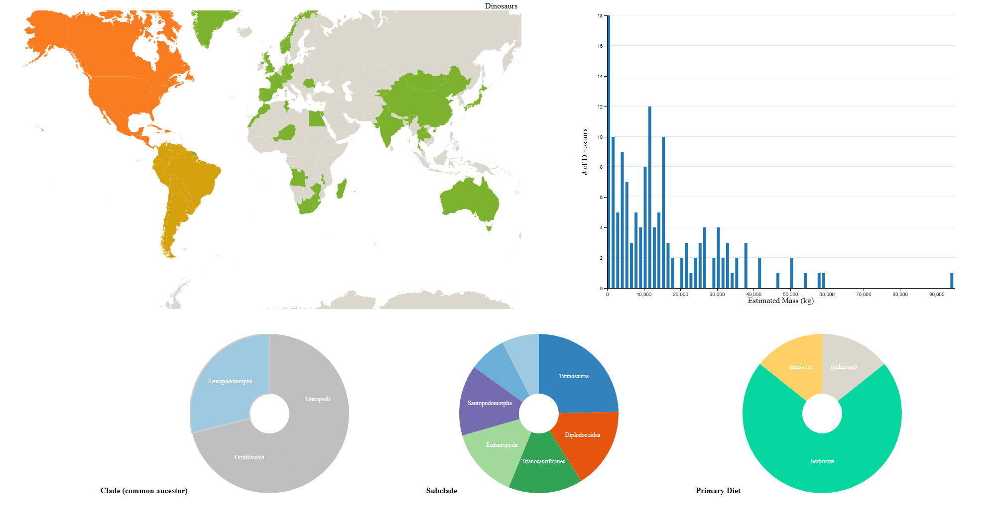

Assignment 4 - Dinosaurs 
===




For Assignment 4, I decided to tap into my childhood dream of becoming a paleontologist. I figured there was a dataset out there containing enough interesting information on dinosaurs for me to put together a visualization with multiple views. I found two datasets, one containing dinosaur's country and fossil location, and the other containing the dinosaur's diet and "clade". I merged these datasets together and set out to make an exploratory dashboard where users could look at dinosaurs through a variety of dimensions.

Github Pages Link
---


Technical Achievements
---

1. Data Gathering/Manipulation - I found two different datasets of dinosaur species and decided both had interesting information. However, the datasets were not set up to be used together initially, so I had to edit the source and parse it intelligently to make it work.
2. Five Views - With the many aspects of dinosaurs, I thought showing more than two views would be worthwhile. Seeing how dinosaur size varies by combinations of location/diet/clade yields a deeper experience for the viewer than just two views.  
3. Map View - One of the views is a geographical map view of the countries of the world, which required finding and loading a Geojson file. I also had to programmatically modify the country data to align with the Geojson features.

Design Achievements
---

1. Color Scheme - I tried to pick nice colors for diet and the map view (ex. carnivore = red, harbivore = green).

References
---

https://dc-js.github.io/dc.js/ - great tutorial on how to use dc.js / crossfilter
https://datadryad.org/stash/dataset/doi:10.5061/dryad.1t3r4 - clade/mass dataset
https://www.kaggle.com/kumazaki98/dinosaur-list - country/diet dataset

GitHub Details
---

- Fork the GitHub Repository. You now have a copy associated with your username.
- Make changes to index.html to fulfill the project requirements. 
- Make sure your "master" branch matches your "gh-pages" branch, if using gh-pages for hosting. See the GitHub Guides referenced above if you need help.
- Edit the README.md with a link to your site, for example http://YourUsernameGoesHere.github.io/04-MapsAndViews/index.html
- To submit, make a [Pull Request](https://help.github.com/articles/using-pull-requests/) on the original repository. Name it: 
```
a4-username-firstName-lastName
```

